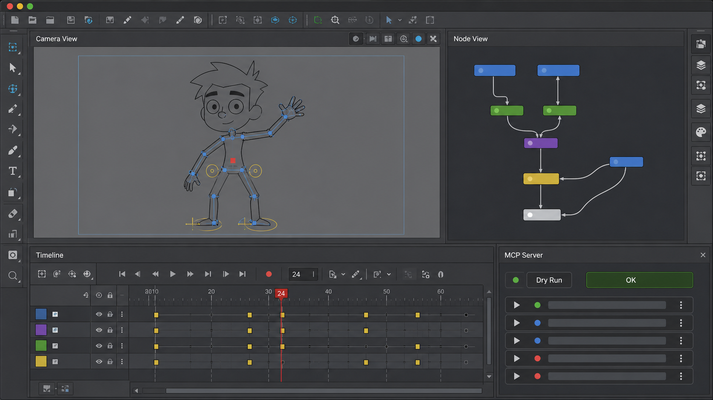
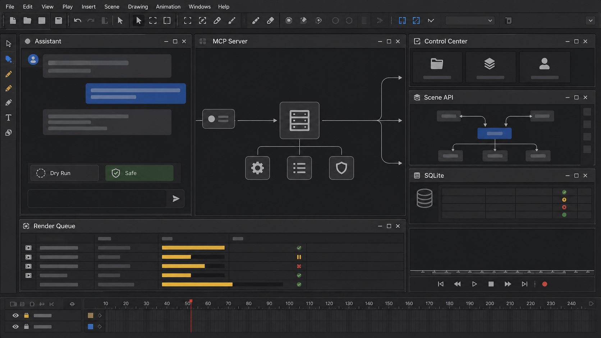
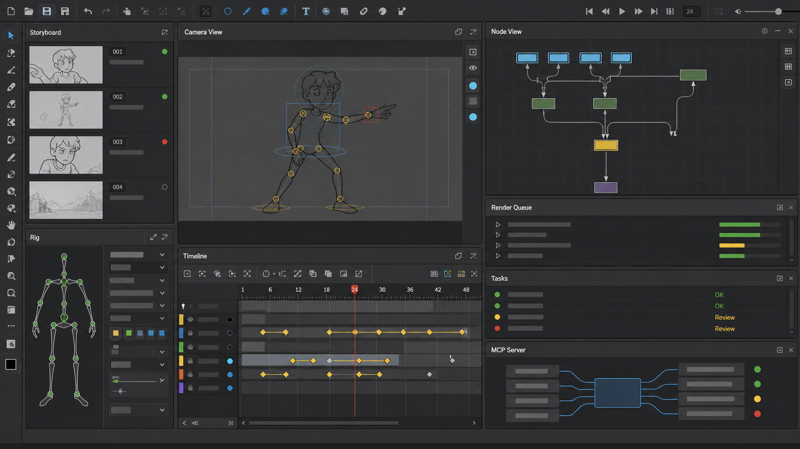

<p align="center">
  
</p>

# Toon Boom Harmony MCP Server

MCP-сервер (Model Context Protocol) промышленного уровня для автоматизации работы с Toon Boom Harmony и Harmony Server.

## Архитектура и рабочий процесс

<p align="center">
  
</p>

Сервер выступает интеллектуальным мостом, позволяющим AI-ассистентам (таким как Claude, Cursor и др.) напрямую взаимодействовать с инструментами автоматизации Toon Boom Harmony:
- **Интеграция с Control Center (Telnet/Batch)**: для работы с серверной инфраструктурой сцен и проектов.
- **Harmony Python API**: для манипуляций с нодами, таймлайном и параметрами сцены.
- **SQLite БД**: для независимого локального трекинга задач и пайплайна.

## Функциональные возможности

- **Интеграция с Control Center (Telnet и Batch)**: Безопасное создание окружений, проектов (jobs), сцен, управление версиями, блокировка сцен, а также импорт и экспорт архивных пакетов.
- **Интеграция с Harmony Python API**: Управление локальным деревом нод, связывание портов, изменение значений атрибутов, проставление ключевых кадров на таймлайне и сохранение сцен.
- **Управление рендерингом**: Добавление сцен в очередь Harmony Server и запуск локального рендеринга и фоновой автовекторизации рисунков.
- **Локальный трекер задач (SQLite)**: Легковесный инструмент отслеживания статусов производства (проекты, эпизоды, сиквенсы, кадры, задачи, ресурсы, заметки) в условиях отсутствия Toon Boom Producer.
- **Многоуровневая безопасность**: Ограничение путей файловой системы (`HARMONY_ALLOWED_ROOTS`), симуляция выполнения (dry-run по умолчанию) и токены подтверждения для опасных (деструктивных) операций.
- **Scene Intelligence и AI Director**: разбор драматических битов и создание разных вариантов постановки.
- **Voice & Performance**: локальный анализ WAV, пауз, энергии и высоты голоса; создание вариантов взгляда, жестов, мимики, дыхания и реакций. Это постановочные планы, а не готовая нативная анимация.

## Автоматизация production-пайплайна

<p align="center">
  
</p>

## Быстрый старт

### 1. Установка зависимостей и сборка
```bash
npm ci
npm run build
python3.9 -m venv .venv-reconstruction
.venv-reconstruction/bin/pip install -r services/reconstruction-core/requirements.lock
.venv-reconstruction/bin/pip install -e services/reconstruction-core --no-deps
```

### 2. Запуск тестов
```bash
npm test
npm run test:python
```

### 3. Запуск MCP-сервера
```bash
npm run start
```

Для реконструкции видео сначала запустите отдельный CPU core:

```bash
npm run reconstruction:core
```

Проверяемое демо без Harmony:

```bash
npm run demo:reconstruction
npm run demo:ai_studio_iter1
npm run demo:ai_studio_iter2
npm run demo:factory:phase1
```

Демо создаёт настоящий MP4, извлекает кадры, строит уникальные векторные drawings, палитру, exposures и валидный манифест. Если Harmony не установлена, результат честно помечается `harmonyApplied: false`.

Демо Iteration 2 создаёт тестовый WAV, реально измеряет его энергию и высоту, строит три варианта актёрской игры и сохраняет автономный HTML-отчёт в `output/ai_studio/iteration2_demo_report.html`.

## Как запустить мост Control Center MCP

Для работы в режиме Harmony Server запустите сервер сценариев Control Center на хост-машине:

**Linux / macOS**:
```bash
export TOONBOOM_REMOTE_SCRIPT=1234
Controlcenter -script -tcpPort 1234
```

**Windows**:
```bat
SET TOONBOOM_REMOTE_SCRIPT=1234
Controlcenter.exe -script -tcpPort 1234
```

Настройте параметры подключения в файле `.env`:
```env
HARMONY_CC_HOST=127.0.0.1
HARMONY_CC_PORT=1234
HARMONY_CC_USER=usabatch
HARMONY_DRY_RUN_DEFAULT=true
HARMONY_ALLOW_DESTRUCTIVE=false
```

> [!WARNING]
> **Никогда не удаляйте и не переименовывайте пользователя `usabatch`!** Данная системная учетная запись используется внутренними службами Harmony для выполнения пакетных задач рендеринга и векторизации.

## Документация (на русском языке)

Подробное руководство находится в папке [docs](docs/):
- [База Знаний Курса по Риггингу (13 Уроков)](playlist_knowledge_base.md)
- [Инструкции и Workflow Плейлиста для Агента](docs/PLAYLIST_WORKFLOWS.md)
- [Инструкция по установке](docs/INSTALL.md)
- [Руководство по конфигурации](docs/CONFIGURATION.md)
- [Правила безопасности](docs/SECURITY.md)
- [Справочник доступных инструментов (Tools)](docs/TOOLS.md)
- [Примеры интеграции (Claude/Cursor/Codex)](docs/EXAMPLES.md)
- [Решение проблем (Troubleshooting)](docs/TROUBLESHOOTING.md)
- [Ограничения версий и совместимости](docs/LIMITATIONS.md)
- [Реконструкция видео в редактируемую сцену](docs/VIDEO_RECONSTRUCTION.md)
