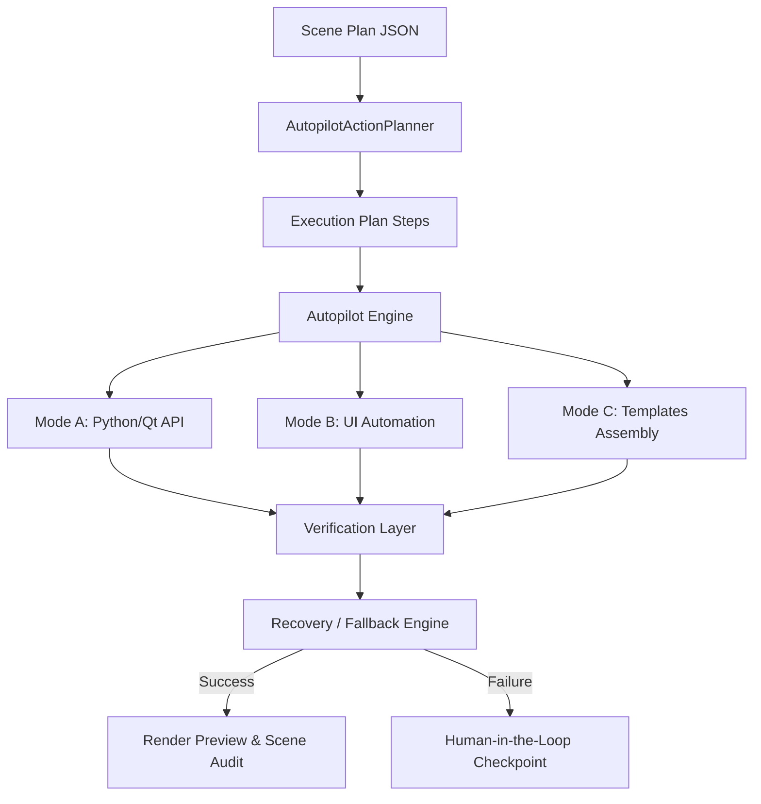

# Harmony Autopilot Architecture

**Harmony Autopilot** — это интеллектуальный оператор для Toon Boom Harmony, разработанный для автоматизации рутинных сборочных и проверочных процессов на анимационных студиях.

## Обзор архитектуры

Система работает как гибридный слой, объединяющий прямой программный доступ (API/Скрипты) и визуальное управление интерфейсом (UI Automation):

## Компоненты автопилота

1. **AutopilotActionPlanner**: Разбирает входящий JSON-план сборки сцены и преобразует его в плоскую структуру шагов `PlanStep`.
2. **UIAutomationAdapter**: Выполняет клики мыши, ввод текста и нажимает хоткеи. При отсутствии установленных библиотек nut.js/robotjs переключается в режим симуляции.
3. **VisualStateEngine**: Снимает скриншоты экрана и анализирует активные панели и диалоговые окна с помощью распознавания образов.
4. **RecoveryEngine**: При сбоях пытается выполнить автоматический откат, повтор кликов, сброс расположения окон (`reset_workspace`) или запрашивает подтверждение у человека.
